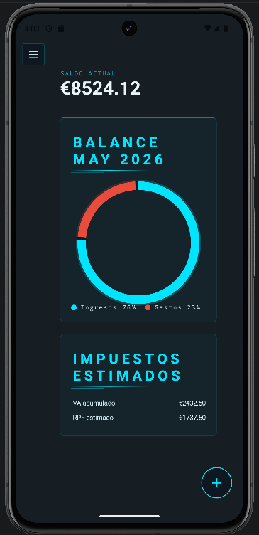

# Metricora 📊 • Kotlin Multiplatform (KMP)

[](https://kotlinlang.org/)
[](https://jetbrains.com/lp/compose-multiplatform/)
[](https://developer.android.com/studio/releases/gradle-plugin)
[](https://insert-koin.io/)

**Metricora** es una aplicación comercial multiplataforma nativa diseñada para gestionar la contabilidad e impuestos (IVA, IRPF y liquidaciones trimestrales) de autónomos bajo el modelo fiscal español. 

A diferencia de las soluciones híbridas tradicionales, Metricora comparte el **100% de la lógica de negocio, reglas fiscales y persistencia** mediante **Kotlin Multiplatform (KMP)**, compilando a código nativo en **5 plataformas**: Android, iOS, Windows, macOS y Linux.

---

## 📸 Capturas de Pantalla e Interfaz Adaptativa

El sistema implementa una interfaz completamente responsiva controlada mediante un gestor de clases de ventana (`rememberWindowClass()`). La navegación se adapta dinámicamente según la densidad y tamaño de la pantalla del dispositivo.

| 📱 Modo Compacto (Android / iOS) | 💻 Modo Expandido (Windows / macOS / Linux) |
|:---:|:---:|
|  |  |
| *Navegación inferior táctil (`K34BottomNav`)* | *Panel de navegación lateral estirado (`K34SideNav`)* |

### 🌗 Experiencia Visual Completa
| Modo Oscuro Integrado | Seguridad y APIs Nativas |
|:---:|:---:|
|  |  |
| *Soporte nativo para temas claro, oscuro y automático* | *Pantalla de bloqueo con autenticación biométrica* |

---

## 🏗️ Arquitectura del Proyecto

El proyecto está diseñado bajo los principios de **Clean Architecture** combinados con el patrón de presentación **MVVM (Model-View-ViewModel)**. El código fuente está rigurosamente modularizado para maximizar la reutilización:

### Desacoplamiento en `commonMain` por Capas:
1.  **`domain/`**: Modelos de datos inmutables y casos de uso (`CalcTaxesUseCase`). Esta capa está libre de dependencias externas o de plataforma.
2.  **`data/`**: Repositorios de datos, servicios de importación/exportación y esquemas de base de datos SQLDelight.
3.  **`di/`**: Módulos de inyección de dependencias centralizados con **Koin**.
4.  **`ui/`**: Vistas declarativas escritas en Compose Multiplatform y lógica de presentación (`ViewModels`).

---

## 🛠️ Detalles de Implementación Técnica y Desafíos Resueltos

### 1. Robustez en el Dominio Fiscal (Cálculos de Precisión)
Para evitar los errores de redondeo aritmético inherentes a los tipos de coma flotante (`Float`, `Double`) al calcular importes fiscales (IVA de 0/4/10/21% e IRPF de 0/7/15%), todos los valores financieros se procesan y almacenan rigurosamente en **céntimos** utilizando el tipo primitivo `Long` a través de la base de datos.

### 2. Inyección de Dependencias Híbrida con Koin 4.2.0
El ciclo de vida de las dependencias se gestiona dividiendo la configuración en módulos compartidos y específicos de plataforma a través de la estrategia `expect / actual`:
*   `AppModule` (`commonMain`): Registra singletons globales, casos de uso, repositorios y ViewModels.
*   `PlatformModule`: Provee fábricas específicas de controladores de bases de datos, sistemas de archivos y servicios de pago.

### 3. Persistencia de Datos Tipo-Segura con SQLDelight 2.0.2
Se utiliza SQLite como motor relacional unificado en todas las plataformas. Debido a que SQLDelight no ejecuta migraciones automáticas en caliente, implementé ganchos manuales de actualización en cada factoría nativa:
*   **Android:** Callback `onUpgrade` inyectando sentencias `ALTER TABLE`.
*   **Desktop:** Verificación manual de esquemas mediante consultas `PRAGMA table_info` antes del montaje del archivo `.db` en el directorio de usuario (`~/.metricora/`).

### 4. Abstracción Plataforma-Específica (`expect` / `actual`)

Para las características que requieren acceso directo a las APIs de bajo nivel de cada sistema operativo, se diseñaron abstracciones abstractas en el Core y se sobrescribieron nativamente:

| Característica / Servicio | Android | iOS | Desktop (JVM) |
| :--- | :--- | :--- | :--- |
| **Controlador de BD** | `AndroidSqliteDriver` | `NativeDriver` | `JdbcSqliteDriver` |
| **Gestión de Tiempos** | `java.util.Calendar` | `NSCalendar` | `java.util.Calendar` |
| **Exportación (PDF/ZIP)** | `Intent` + `FileProvider` | `UIActivityViewController` | `java.io.File` |
| **Seguridad Biométrica** | `BiometricPrompt` | `LocalAuthentication` | *Stub* |
| **Alertas en Background** | `AlarmManager` | `UNUserNotificationCenter` | *Stub* |
| **Selector de Archivos CSV** | `ActivityResultContracts` | `UIDocumentPickerViewController` | `JFileChooser` |

### 5. Flujos Reactivos de Datos (Coroutines y StateFlow)
La interfaz es 100% reactiva. Los ViewModels exponen estados de pantalla síncronos consumidos en la UI con `collectAsStateWithLifecycle()`. Se utiliza composición avanzada de flujos mediante operadores `combine()` para cruzar datos de transacciones e hilos de filtrado sin bloquear el hilo principal de renderizado (UI Thread):

```kotlin
val state: StateFlow<ScreenState> = combine(filterFlow, transactionsFlow) { filter, transactions -> 
    // Filtrado y cálculo asíncrono en segundo plano
    ScreenState.Success(processedData)
}.stateIn(
    scope = viewModelScope, 
    started = SharingStarted.WhileSubscribed(5000), 
    initialValue = ScreenState.Loading
)
